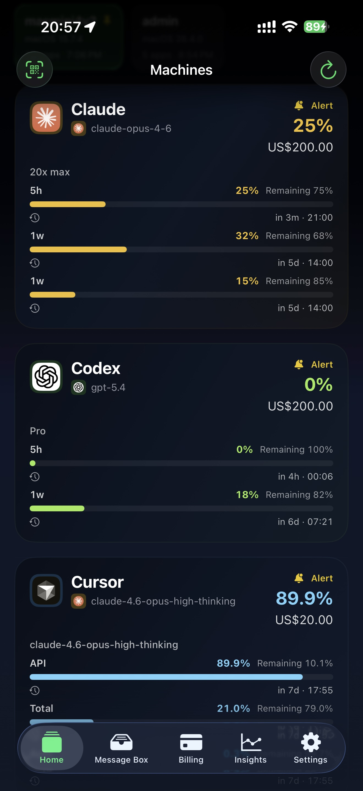
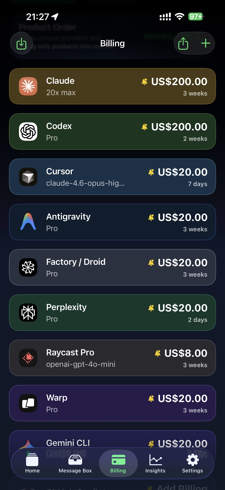
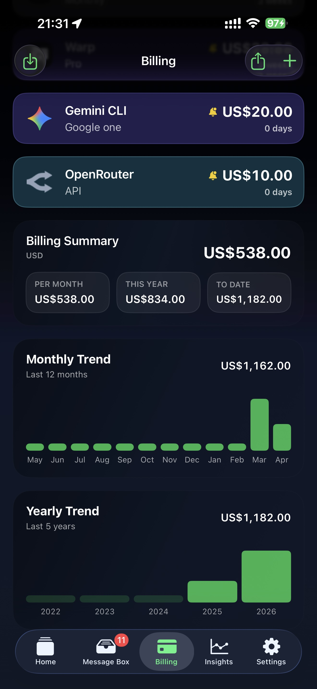
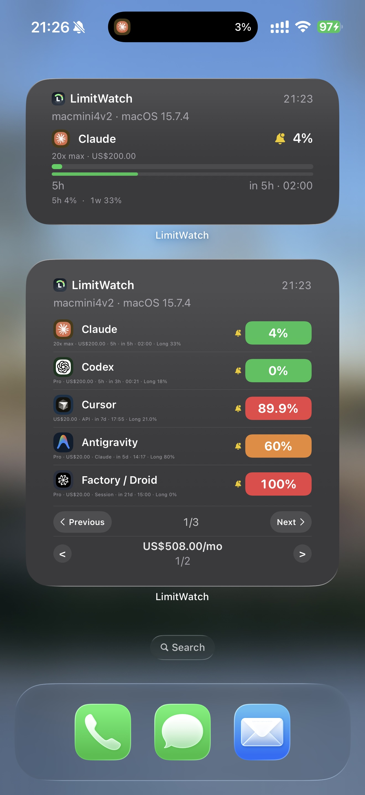
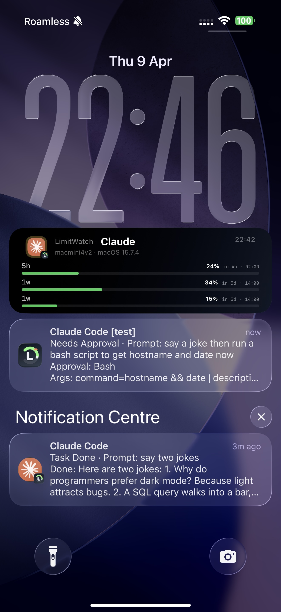
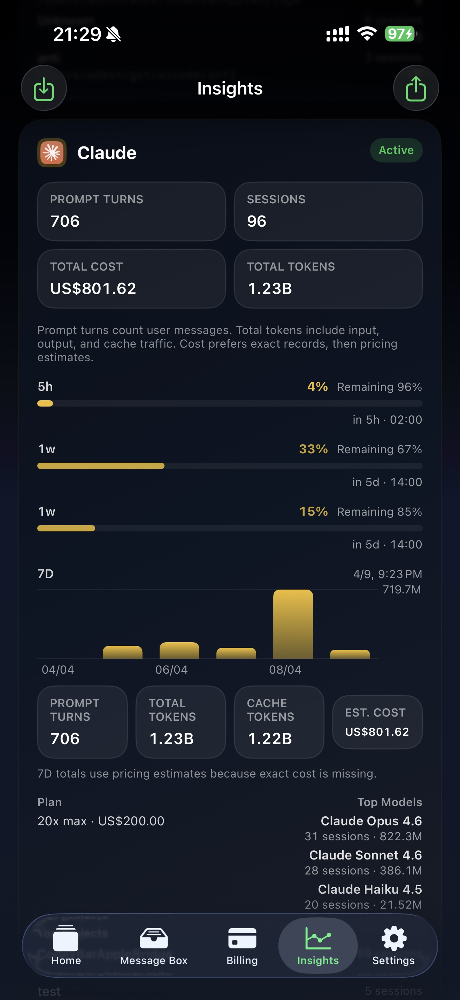

# LimitWatch

**AI coding tools companion — Dynamic Island, Apple Watch, and push notifications for your Mac-based AI workflows**

 

<picture>
  
</picture>
&nbsp;&nbsp;
<picture>
  
</picture>
&nbsp;&nbsp;
<picture>
  
</picture>

  

<picture>
  
</picture>
&nbsp;&nbsp;
<picture>
  
</picture>
&nbsp;&nbsp;
<picture>
  
</picture>

 

## Features

- **Dynamic Island & Live Activity** — AI session status, active tool, token usage, and approval requests at a glance
- **Push Notifications** — session complete, tool approval needed, errors, quota alerts
- **Multi-Source Monitoring** — track Claude, Codex, Gemini, Cursor, Copilot, Droid, OpenCode simultaneously
- **Approval Flow** — approve or deny tool execution from iPhone or Apple Watch
- **Quota & Usage Tracking** — monitor API spend and remaining quotas across Anthropic, OpenAI, Google
- **Apple Watch** — complications and full watch app for session status and quick approvals
- **Widgets** — Home Screen and Lock Screen widgets for at-a-glance usage data
- **Session Archive** — browse past sessions, review transcripts, export for analysis
- **Precise Terminal Jump** — click a notification to jump to the exact terminal window/tab/pane
- **Auto Updates** — built-in Sparkle for seamless Mac updates
- **Privacy First** — all data on-device, synced via your personal iCloud. No third-party servers

## Install

### Mac (free)

1. **Download** the latest DMG from [Releases](https://github.com/ducksee/limitwatch-releases/releases/latest)
2. Open the DMG, drag LimitWatch to **Applications**
3. Launch — first run auto-configures hooks for your AI tools

> Signed & notarized by Apple. macOS 14 Sonoma or later, Apple Silicon & Intel.

### iOS

Coming soon on the App Store.

## Supported AI Tools

  &nbsp;<strong>Claude Code</strong>&nbsp;&nbsp;
  &nbsp;<strong>OpenAI Codex</strong>&nbsp;&nbsp;
  &nbsp;<strong>Google Gemini CLI</strong>&nbsp;&nbsp;
  &nbsp;<strong>Cursor</strong>&nbsp;&nbsp;
  &nbsp;<strong>GitHub Copilot</strong>

Also supports: Droid (Factory) · OpenCode · Warp AI · and more

## Supported Terminals

iTerm2 · Ghostty · Terminal.app · Warp · VS Code · Cursor · Alacritty · Kitty · WezTerm · Hyper · Zed · tmux · screen

---

[All Releases](https://github.com/ducksee/limitwatch-releases/releases) · [Website](https://limitwatch.app) · [Privacy Policy](https://limitwatch.app/privacy)

